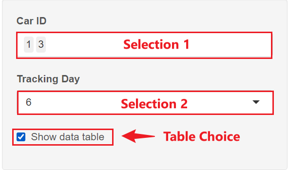
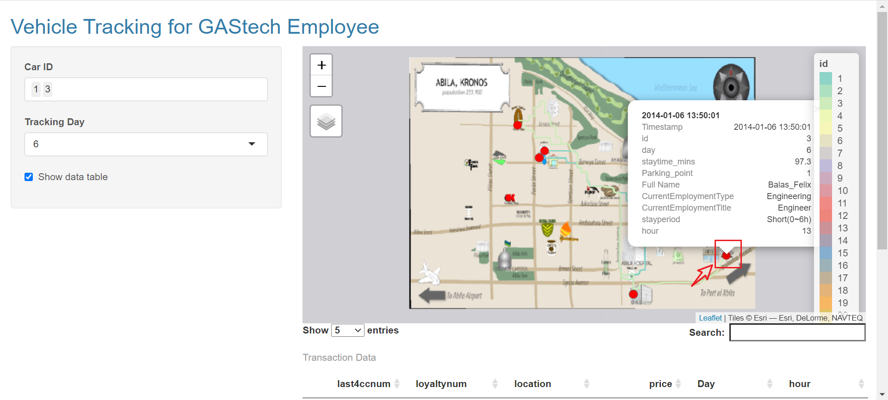
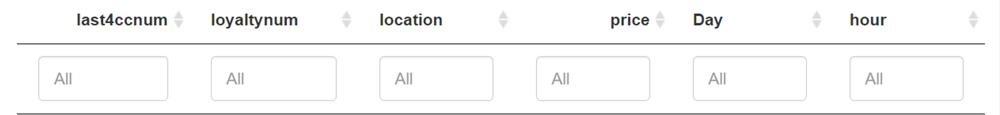

```{r setup, include=FALSE}
knitr::opts_chunk$set(echo = FALSE)
```
# 1.Geospatial Visualization Instruction

Use this tab to do exploratory data analysis.

**1) Selection1(Car ID)**: User can select one or multiple Car ID for them to show employee's route.

**2) Selection2(Day)**: User can select Day(6-19) to pick Day they want to explore

**3) Show data table**: User can click to have a view of employee's transaction data

{width=60%}

<font size="2" color="black">*Figure 1 Select Input*</font>

**4) Click Tooltip**: User can click red point in the map to have a view of employee's transaction data


<font size="2" color="black">*Figure 2 Tooltip*</font>


**5) Data Table**: User can input data they want to explore in the interactive data table.


<font size="2" color="black">*Figure 3 Interaction Data Table*</font>


**Memo:**If you want to explore the application, please click [<font size="3"  color="blue">*Visual Analytics App*</font>](https://rjourney-linan.shinyapps.io/visualizationapp/?_ga=2.87113489.869695179.1628960403-1663082463.1628304777)


