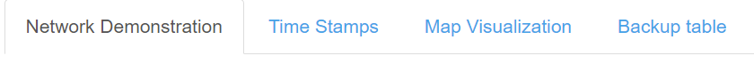
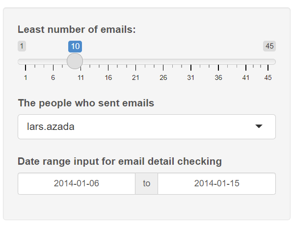
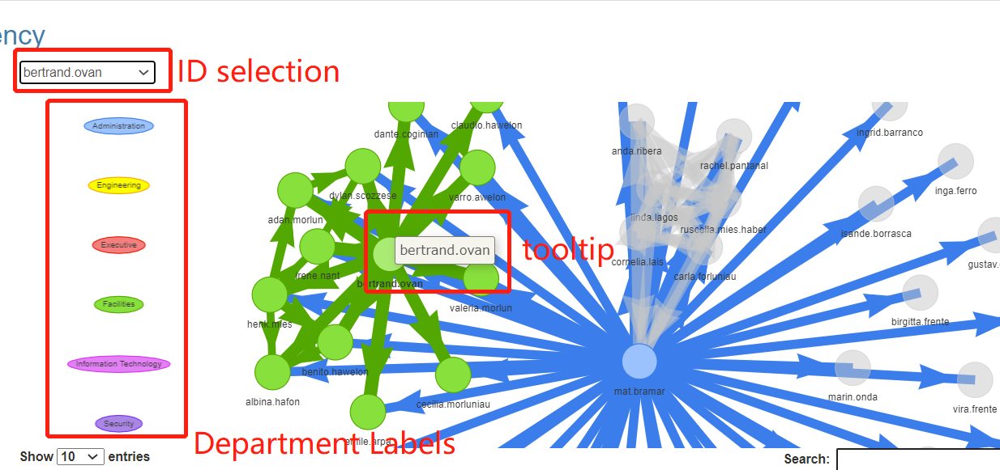
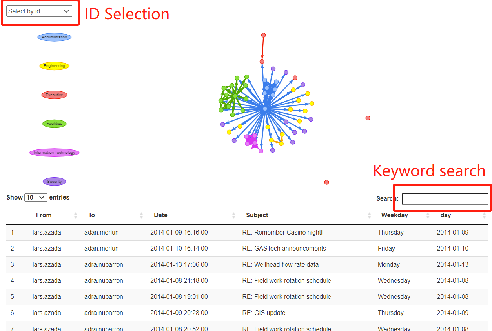
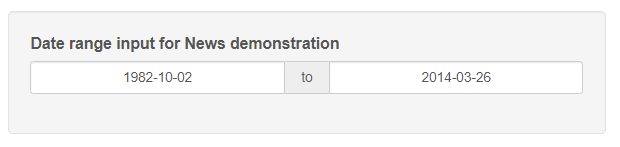
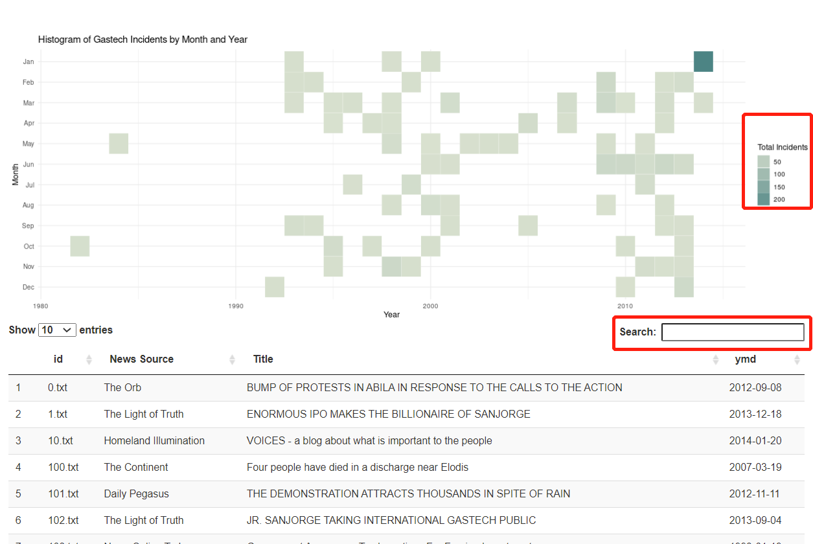
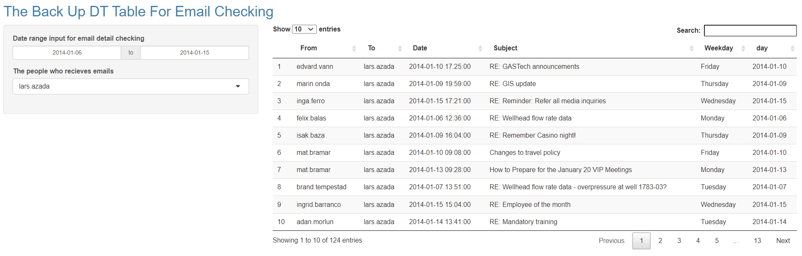

```{r setup, include=FALSE}
knitr::opts_chunk$set(echo = FALSE)
```
# 1.Interface selection

When opening the interface, there will be four tabs on the upper left which enable user to select the inteded analysis interface. The four tabs are: Network Demonstration, Time Stamps, Map Visualization, Backup table.

  {width=70%}

# 2.Network Visualization Instruction

## 2.1 Control Interface

**1) Slider Selection(Least number of emails)**: User can select the threshold of least number of emails in the network graph. User can either set this value to 1 and see all the weighted network or decrease the number of connections by increase this value.

**2) Drop List Selection(The people who sent emails)**: Single selection for user to explore the email details in DT table by setting the email sender.

**3) Time Range Selection(Date tange input for email detail checking)**: This time range controls both DT table and Network visualization, user can set any time slot to see the email network connection and check the details in DT table.

  {width=40%}

## 2.2 Display Interface

**1) Email Network**: This network shows the connection between GAStech employees. The Department labels allow user to distinguish the department of nodes and the source of emails by different color. User can select the ID of interested person, and the un-correlated nodes will fade to grey. Also user may slide the mouse wheel to zoom in/zoom out to see the person name of each node, hover the mouse to the node can also got the result by reading the tooltip.

  

**2) DT table**: The table displays the email details regarding to the selected sending source. User may also conduct keyword search for this table.

  

# 3.Heatmap Instruction
The second tab names Time Stamps is actually a heatmap demonstration related to event news.

## 3.1 Control Interface
This time range controls both DT table and Heatmap visualization, user can set any time slot to see the News heatmap and check the details in DT table.

  {width=40%}

## 3.2 Display Interface

**1) Heatmap(Histogram of Gastech Incidents by Month and Year)**: User can select the intended time period and the label show the "heat" of the incidents.

**2) News DT table**: The table displays the news details regarding to the selected time period. User may find the source and title of each news, and they may also conduct keyword search for this table.

  

# 4.Geospatial Visualization Instruction

**1) Selection1(Car ID)**: User can select one or multiple Car ID for them to show employee's route.

**2) Selection2(Day)**: User can select Day(6-19) to pick Day they want to explore

**3) Show data table**: User can click to have a view of employee's transaction data

{width=60%}
<font size="2" color="black">*Figure 1 Select Input*</font>

**4) Click Tooltip**: User can click red point in the map to have a view of employee's transaction data


<font size="2" color="black">*Figure 2 Tooltip*</font>


**5) Data Table**: User can input data they want to explore in the interactive data table.


<font size="2" color="black">*Figure 3 Interaction Data Table*</font>


# 5.Backup table Instruction
The forth tab names Backup table is a backup table which similar to the DT table in Email Visualization, the only difference here is this graph can be used to find the people who receive emails.

  


**Memo:**If you want to explore the application, please click [<font size="3"  color="blue">*Visual Analytics App*</font>](https://liyueting.shinyapps.io/VisualAppGroup1/)


